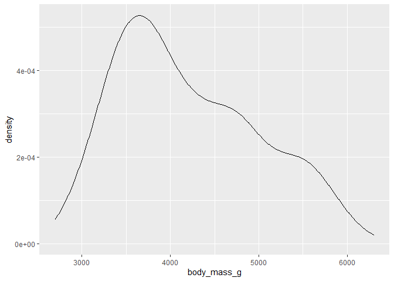
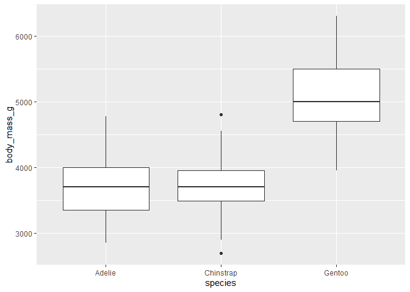
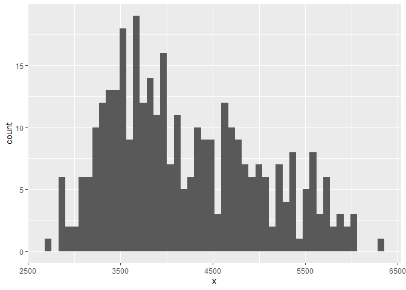

HW01
================
Khoa Nguyen
1/25/2021

## Summary

The mean of the body mass for the penguins is around 4,202 grams
counting both the male and female penguins with the lowest body mass
being 2,700g and the heaviest being 4,202g. This information is slightly
bias as there are more Adelie penguins more than the other two which can
skew the data.

## Quick look at the data.

``` r
str(penguins)
```

    ## tibble [344 x 8] (S3: tbl_df/tbl/data.frame)
    ##  $ species          : Factor w/ 3 levels "Adelie","Chinstrap",..: 1 1 1 1 1 1 1 1 1 1 ...
    ##  $ island           : Factor w/ 3 levels "Biscoe","Dream",..: 3 3 3 3 3 3 3 3 3 3 ...
    ##  $ bill_length_mm   : num [1:344] 39.1 39.5 40.3 NA 36.7 39.3 38.9 39.2 34.1 42 ...
    ##  $ bill_depth_mm    : num [1:344] 18.7 17.4 18 NA 19.3 20.6 17.8 19.6 18.1 20.2 ...
    ##  $ flipper_length_mm: int [1:344] 181 186 195 NA 193 190 181 195 193 190 ...
    ##  $ body_mass_g      : int [1:344] 3750 3800 3250 NA 3450 3650 3625 4675 3475 4250 ...
    ##  $ sex              : Factor w/ 2 levels "female","male": 2 1 1 NA 1 2 1 2 NA NA ...
    ##  $ year             : int [1:344] 2007 2007 2007 2007 2007 2007 2007 2007 2007 2007 ...

## Summary Table of the Data.

``` r
summary(penguins)
```

    ##       species          island    bill_length_mm  bill_depth_mm  
    ##  Adelie   :152   Biscoe   :168   Min.   :32.10   Min.   :13.10  
    ##  Chinstrap: 68   Dream    :124   1st Qu.:39.23   1st Qu.:15.60  
    ##  Gentoo   :124   Torgersen: 52   Median :44.45   Median :17.30  
    ##                                  Mean   :43.92   Mean   :17.15  
    ##                                  3rd Qu.:48.50   3rd Qu.:18.70  
    ##                                  Max.   :59.60   Max.   :21.50  
    ##                                  NA's   :2       NA's   :2      
    ##  flipper_length_mm  body_mass_g       sex           year     
    ##  Min.   :172.0     Min.   :2700   female:165   Min.   :2007  
    ##  1st Qu.:190.0     1st Qu.:3550   male  :168   1st Qu.:2007  
    ##  Median :197.0     Median :4050   NA's  : 11   Median :2008  
    ##  Mean   :200.9     Mean   :4202                Mean   :2008  
    ##  3rd Qu.:213.0     3rd Qu.:4750                3rd Qu.:2009  
    ##  Max.   :231.0     Max.   :6300                Max.   :2009  
    ##  NA's   :2         NA's   :2

## Number of penguins per species.

``` r
summary(penguins$species)
```

    ##    Adelie Chinstrap    Gentoo 
    ##       152        68       124

## Number of data entry.

``` r
nrow(penguins)
```

    ## [1] 344

## Penguin Body Mass Plot

The data set for body mass of the penguins seems to be right-skewed with
the plot graph being slightly confusing to analyze.

This analysis of the graph is accounting for every species of penguins
put into one analysis rather than smaller chunk of analysis focusing on
only one specific species of penguins.

``` r
ggplot(penguins, aes(body_mass_g)) +
  geom_density()
```

    ## Warning: Removed 2 rows containing non-finite values (stat_density).

<!-- -->

## Penguin’s Body Mass in Species

Gentoo penguin species seems to have the highest mean of body weight
when compared to both Chinstrap and Adelie

``` r
echo={FALSE}
ggplot(penguins, aes(species, body_mass_g)) +
  geom_boxplot()
```

    ## Warning: Removed 2 rows containing non-finite values (stat_boxplot).

<!-- -->

``` r
eval = FALSE
```

## Histogram plot for penguins’ body mass.

Variable ***x*** in this case represents penguins’ body mass for all
species

``` r
ggplot(penguins, aes(x)) +
  geom_histogram(bins = 50)
```

    ## Warning: Removed 2 rows containing non-finite values (stat_bin).

<!-- -->
